<div align="center">

<picture>
  <source media="(prefers-color-scheme: dark)" srcset="./assets/hero-dark.svg">
  <source media="(prefers-color-scheme: light)" srcset="./assets/hero-light.svg">
  
</picture>

<p></p>

<a href="https://melihmeral.dev"></a>
<a href="mailto:coder@melihmeral.dev"></a>
<a href="https://www.linkedin.com/in/melihmerall/"></a>
<a href="https://twitter.com/melihmeralll"></a>
<a href="https://bionluk.com/melihmeral"></a>

</div>

<br/>

I'm a full stack developer based in **Bursa, Türkiye**. For more than five years I've built enterprise systems on **.NET** and product interfaces on **React / Next.js**, and for the last few I've also been leading the teams that ship them.

My work runs from the database schema to the deploy pipeline. I care about systems that stay easy to change a year later, releases that land on the date I promised, and documentation the next developer will actually read.

These days I build **AI-native**: agents write a large share of the code, and I own the architecture, the review, and the result.

<br/>

## ⚡ Right now

```text
▸ Architecting a multi-tenant sales, inventory & barcode platform on .NET 10
▸ Leading development of a real-time peer-learning platform for teens (Next.js 16 + Supabase)
▸ Rebuilding e-commerce stores on ASP.NET Core 10 with iyzico 3D Secure payments
▸ Running bancassurance backend work at AcerPro and project leadership at HEXAOPS
```

<br/>

## 🧭 Experience

| Period | Role | Company |
| :-- | :-- | :-- |
| `2024–now` | **Full Stack Developer** | [AcerPro](https://www.acerpro.com.tr) · bancassurance platform |
| `2023–now` | **Software Consultant** | [MAYFly Aviation R&D](https://www.mayfly.com.tr/) · system modernization |
| `2022–now` | **Project Development Manager / Team Lead** | HEXAOPS Technology · multiple digital products |
| `2023–24` | **Backend Developer** (remote) | [Curie Soft, LLC](https://www.linkedin.com/company/curie-soft-llc/about/) · US-based SaaS |
| `2023` | **Software Instructor** | [TALENT14 / Bilişim School](https://www.bilisimschool.com/) · C# & ASP.NET Core curriculum |
| `2020–23` | **Freelance Developer** | [Bionluk](https://bionluk.com/melihmeral) · web apps & internal tools for SMEs |

<details>
<summary><b>Measured results</b></summary>
<br/>

- **−60% latency** on a policy issuance API, using a CQRS refactor and Redis cache-aside
- **Deploys went from 40 min to 8 min** after I built a GitHub Actions pipeline from scratch
- **Monolith → microservices:** DDD bounded contexts, a RabbitMQ event bus and a YARP gateway, with 3 services moved to AKS
- **.NET Framework 4.8 → .NET 8** port, including EF6 → EF Core and N+1 fixes with Dapper
- Brought **code review standards and ADRs** (Architecture Decision Records) into the team's routine

</details>

<br/>

## 🛠️ Stack

<table>
  <tr>
    <td width="130"><b>Backend</b></td>
    <td></td>
    <td>.NET 10 · ASP.NET Core · EF Core + Dapper · Clean Architecture · CQRS (MediatR) · Hangfire</td>
  </tr>
  <tr>
    <td><b>Frontend</b></td>
    <td></td>
    <td>Next.js App Router · Server Components · TypeScript strict · Zustand + React Query</td>
  </tr>
  <tr>
    <td><b>Data</b></td>
    <td></td>
    <td>SQL Server · PostgreSQL · Supabase (RLS, Realtime) · Redis · Elasticsearch</td>
  </tr>
  <tr>
    <td><b>Distributed</b></td>
    <td></td>
    <td>RabbitMQ + MassTransit · Outbox & Saga · gRPC · YARP API Gateway</td>
  </tr>
  <tr>
    <td><b>Cloud & Ops</b></td>
    <td></td>
    <td>Multi-stage Docker · AKS + Helm · blue-green deploys · IIS / Plesk · Vercel</td>
  </tr>
  <tr>
    <td><b>Observability</b></td>
    <td></td>
    <td>OpenTelemetry · Serilog structured logs · Prometheus · Grafana alerting</td>
  </tr>
</table>

<br/>

## 🤖 How I build in 2026

<table>
  <tr>
    <td width="50%" valign="top">

**AI in the workflow**

- **Claude Code** as a daily pair, with agents doing the heavy lifting
- **MCP tooling:** Figma for design-to-code, Playwright to check the running app, Context7 for up-to-date docs
- **Spec-first:** each business rule goes into `docs/` and `CLAUDE.md` before any code
- Every change gets human review. The AI's speed helps me ship, but I still decide what goes in.

</td>
<td width="50%" valign="top">

**AI in the product**

- **Claude API** with tool use and streaming
- **Semantic Kernel** orchestration inside .NET services
- **RAG pipelines** with Qdrant vector search
- Event-triggered AI assistants that respond to specific product events, with no open-ended chatbot

</td>
  </tr>
</table>

<br/>

## 🧱 Rules I don't bend

```text
01  Prices and totals are calculated on the server. The client never sends them.
02  Payment callbacks are idempotent. A retry must never charge twice.
03  Row-level security is on by default. Service keys stay in admin and cron jobs.
04  Docs come before code. A new rule is written into the spec first.
05  Secrets never get committed to the repo, not even "just for staging".
06  Code is written in English. The UI speaks the user's language.
```

<br/>

## 📈 Activity

<div align="center">

<picture>
  <source media="(prefers-color-scheme: dark)" srcset="https://raw.githubusercontent.com/melihmerall/melihmerall/output/github-snake-dark.svg">
  <source media="(prefers-color-scheme: light)" srcset="https://raw.githubusercontent.com/melihmerall/melihmerall/output/github-snake.svg">
  
</picture>

<sub>Most of my client work lives in private repositories, so the public graph shows only part of it.</sub>

</div>

<br/>

<div align="center">

**Have a product, an API, or a legacy system that needs to move forward?**

<a href="mailto:coder@melihmeral.dev"></a>

<sub><code>git push origin main --force  # calculated risk</code></sub>

</div>
